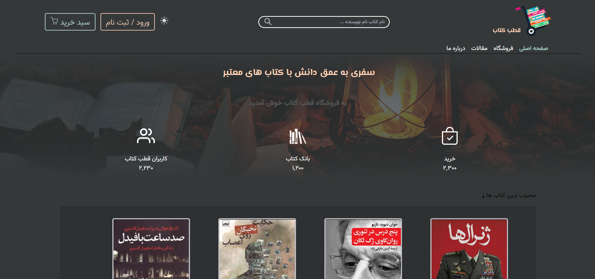

# book store project <a href='https://book-web-store.iran.liara.run'> demo </a>

<a href='https://book-web-store.iran.liara.run'></a>

## about project 

<p>The 'Book store' is an online book-selling website where books can be purchased electronically. Membership is available on this website, allowing users to access all the features of the site.</p>

## run project 

```bash
git clone https://github.com/MehrdadSabori/book-store-web

```
#### chenge directory

```bash
cd your-project

```

#### install dependencies 

```bash
npm install

```

#### start 

```bash
npm run dev

```

### project pakage

- react-icons
- react-router-dom
- react-tooltip
- sweetalert2
- swiper
- typewriter-effect
- crisp-sdk-web


## Features

- dark mode & light mode (Theme)
- responsive
- css gid
- flex box
- register & login form